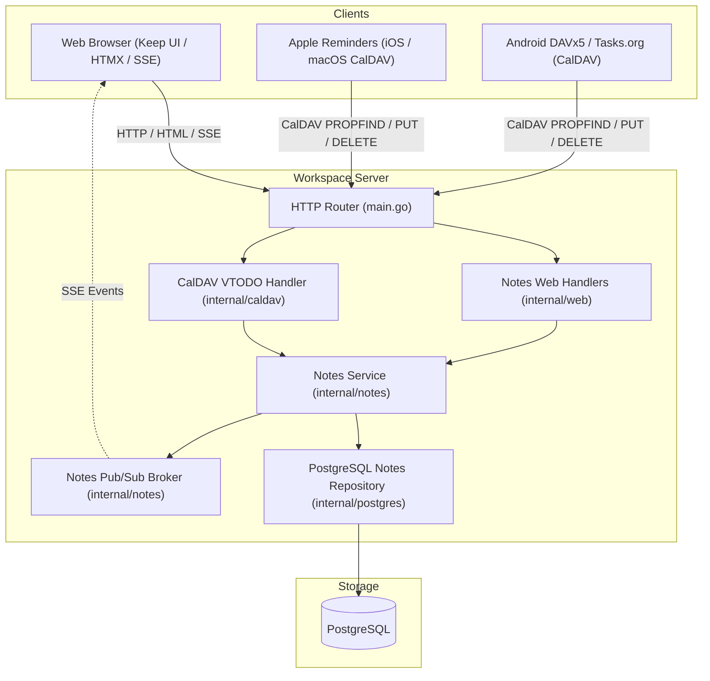

# Notes & Lists (Google Keep & Tasks Replacement) Design Spec

**Date:** 2026-09-18  
**Status:** Approved  
**Target:** Workspace Family Productivity Suite  

---

## 1. Objective

Provide a self-hosted, privacy-focused alternative to **Google Keep** and **Google Tasks** tailored for family use within the Workspace platform. The solution delivers:
1. A modern, responsive web application inspired by Google Keep (cards, checklists, pastel colors, pinned notes, tags, and search).
2. Real-time list updates using Server-Sent Events (SSE) so family members checking off grocery or shopping items see updates instantly.
3. Native mobile device synchronization via CalDAV VTODO (RFC 4791 / RFC 5545), allowing Apple Reminders (iOS/macOS) and Android task apps (DAVx5/Tasks.org) to sync shared family checklists.
4. Straightforward family sharing: private by default with an instant "Share with Family" toggle.

---

## 2. Architecture & Components

The subsystem integrates into the existing Workspace architecture alongside Mail, Calendar, Contacts, Drive, and Photos:



### Component Structure
* **`internal/notes`**: Domain types (`Note`, `NoteItem`, `NoteTag`), service business logic, authorization rules, and event broker.
* **`internal/postgres`**: Database schema migrations and SQL repositories (`NoteRepository`, `NoteItemRepository`, `NoteTagRepository`).
* **`internal/format/vtodo`**: RFC 5545 parser and serializer for mapping checklist items to and from `VTODO` iCalendar components.
* **`internal/caldav`**: Enhanced CalDAV server discovering `/cal/lists/{noteID}/` collections and translating HTTP `GET`, `PUT`, `DELETE`, and `REPORT` requests.
* **`internal/web`**: Web HTTP handlers, server-rendered HTML templates (`web/templates/notes.html`), static assets, and SSE streaming endpoint `/notes/live`.

---

## 3. Data Model & Database Schema

### Database Tables (PostgreSQL Migration)

```sql
-- 1. Notes table
CREATE TABLE notes (
    id UUID PRIMARY KEY DEFAULT gen_random_uuid(),
    user_id UUID NOT NULL REFERENCES users(id) ON DELETE CASCADE,
    title TEXT NOT NULL DEFAULT '',
    body TEXT NOT NULL DEFAULT '',
    kind VARCHAR(16) NOT NULL DEFAULT 'note', -- 'note' or 'list'
    color VARCHAR(24) NOT NULL DEFAULT 'default',
    is_pinned BOOLEAN NOT NULL DEFAULT FALSE,
    is_archived BOOLEAN NOT NULL DEFAULT FALSE,
    is_family_shared BOOLEAN NOT NULL DEFAULT FALSE,
    created_at TIMESTAMPTZ NOT NULL DEFAULT NOW(),
    updated_at TIMESTAMPTZ NOT NULL DEFAULT NOW()
);

CREATE INDEX idx_notes_user_lookup ON notes(user_id, is_archived, is_pinned DESC, updated_at DESC);
CREATE INDEX idx_notes_family_shared ON notes(is_family_shared, is_archived, is_pinned DESC, updated_at DESC) WHERE is_family_shared = TRUE;

-- 2. Checklist items table
CREATE TABLE note_items (
    id UUID PRIMARY KEY DEFAULT gen_random_uuid(),
    note_id UUID NOT NULL REFERENCES notes(id) ON DELETE CASCADE,
    content TEXT NOT NULL,
    completed BOOLEAN NOT NULL DEFAULT FALSE,
    completed_at TIMESTAMPTZ NULL,
    sort_order INTEGER NOT NULL DEFAULT 0,
    created_at TIMESTAMPTZ NOT NULL DEFAULT NOW(),
    updated_at TIMESTAMPTZ NOT NULL DEFAULT NOW()
);

CREATE INDEX idx_note_items_note ON note_items(note_id, sort_order ASC, created_at ASC);

-- 3. Tags table
CREATE TABLE note_tags (
    id UUID PRIMARY KEY DEFAULT gen_random_uuid(),
    user_id UUID NOT NULL REFERENCES users(id) ON DELETE CASCADE,
    name VARCHAR(60) NOT NULL,
    created_at TIMESTAMPTZ NOT NULL DEFAULT NOW(),
    UNIQUE(user_id, name)
);

-- 4. Note-Tags junction table
CREATE TABLE notes_tags (
    note_id UUID NOT NULL REFERENCES notes(id) ON DELETE CASCADE,
    tag_id UUID NOT NULL REFERENCES note_tags(id) ON DELETE CASCADE,
    PRIMARY KEY(note_id, tag_id)
);
```

### Color Palette
Supported card theme tokens:
* `default` (standard surface card)
* `coral` (`#f28b82` / dark tint)
* `peach` (`#fbbc04` / dark tint)
* `sand` (`#fff475` / dark tint)
* `mint` (`#ccff90` / dark tint)
* `sage` (`#a7ffeb` / dark tint)
* `fog` (`#cbf0f8` / dark tint)
* `storm` (`#aecbfa` / dark tint)
* `blossom` (`#fdcfe8` / dark tint)
* `clay` (`#e6c9a8` / dark tint)

---

## 4. CalDAV VTODO Bridge

### 1. CalDAV Collection Discovery
When a client queries calendar collections via `PROPFIND /cal/`:
* The server lists existing `VEVENT` calendars and also reports task collections (`supported-calendar-component-set: VTODO`).
* **Private Lists**: Checklists where `user_id = auth_user_id AND is_family_shared = FALSE AND is_archived = FALSE`.
* **Shared Family Lists**: Checklists where `is_family_shared = TRUE AND is_archived = FALSE`.
* Collection URL: `/cal/lists/{note_id}/` with `displayname` equal to `notes.title` (or "Untitled List").

### 2. Item Serialization (RFC 5545 VTODO)
Each item in `note_items` is exposed as `/cal/lists/{note_id}/{item_id}.ics`.

```text
BEGIN:VCALENDAR
VERSION:2.0
PRODID:-//Workspace//Notes VTODO 1.0//EN
BEGIN:VTODO
UID:c383f982-f384-4860-9cb5-b0b30172bf42
DTSTAMP:20260918T120000Z
SUMMARY:Oat milk
STATUS:NEEDS-ACTION
CREATED:20260918T100000Z
LAST-MODIFIED:20260918T120000Z
END:VTODO
END:VCALENDAR
```

* When `completed = TRUE`, the VTODO includes `STATUS:COMPLETED` and `COMPLETED:<timestamp>`.
* Incoming `PUT` creates or updates the item in `note_items` and notifies the SSE broker.
* Incoming `DELETE` removes the row and notifies the SSE broker.

---

## 5. Web UI & Real-Time Sync (Keep-Style)

### 1. Routes
* `GET /notes`: Render full dashboard (cards grid, quick-add header, tag filter sidebar).
* `POST /notes`: Create note or checklist.
* `GET /notes/{id}`: Render single note detail / edit view.
* `POST /notes/{id}`: Update title, body, color, pinned status, archive status, or family sharing.
* `POST /notes/{id}/delete`: Delete note (owner or admin only).
* `POST /notes/{id}/items`: Append item to checklist.
* `POST /notes/{id}/items/{itemID}/toggle`: Atomically flip item `completed` status.
* `POST /notes/{id}/items/{itemID}/delete`: Delete an item from checklist.
* `GET /notes/live`: SSE stream (`text/event-stream`).

### 2. SSE Pub/Sub Broker
```go
type Event struct {
    Type      string    `json:"type"`       // "item_toggled", "item_added", "note_updated", "item_deleted"
    NoteID    uuid.UUID `json:"note_id"`
    ItemID    uuid.UUID `json:"item_id,omitempty"`
    Completed bool      `json:"completed,omitempty"`
    UserID    uuid.UUID `json:"user_id"`    // Actor who made the change
}
```
* The web page establishes an SSE connection to `/notes/live`.
* When an action occurs (either via web UI or CalDAV on phone):
  1. The database row is committed.
  2. The broker pushes an event to connected clients.
  3. HTMX or a lightweight JS listener swaps the checkbox state / item style without page reload.

---

## 6. Security & Access Control Matrix

| Action | Private Note (Owner) | Private Note (Other Family Member) | Family Shared Note (Any Member) |
| :--- | :--- | :--- | :--- |
| **Read / View** | Allowed | Denied (`404 Not Found`) | Allowed |
| **Add / Edit / Toggle Items** | Allowed | Denied (`404 Not Found`) | Allowed |
| **Change Color / Pin (local)** | Allowed | Denied (`404 Not Found`) | Allowed |
| **Toggle "Share with Family"**| Allowed | Denied (`403 Forbidden`) | Owner or Admin only |
| **Delete Note** | Allowed | Denied (`403 Forbidden`) | Owner or Admin only |

* Web UI operations enforce CSRF protection via double-submit token (`_csrf`).
* CalDAV operations enforce Basic Auth with password or per-device App Passwords (`deviceAuth`).

---

## 7. Verification & Testing Plan

1. **Unit Tests**:
   - `internal/notes`: CRUD operations, filtering by tags/archived/family, sorting items by order.
   - `internal/format/vtodo`: Test serialization of `NoteItem` to RFC 5545 `VTODO` and parsing of incoming Apple Reminders `VTODO` payloads.
   - Access control tests: Verify non-owners receive `404` for private notes and cannot mutate items.
2. **Integration / HTTP Tests**:
   - Web endpoints: Verify `/notes` template rendering, note creation, item addition, and atomic toggles.
   - CalDAV tests: Test `PROPFIND` discovering list collections, `PUT` upserting a task, `DELETE` removing a task.
   - SSE Broker tests: Verify broadcast message receipt across multiple subscribers.
